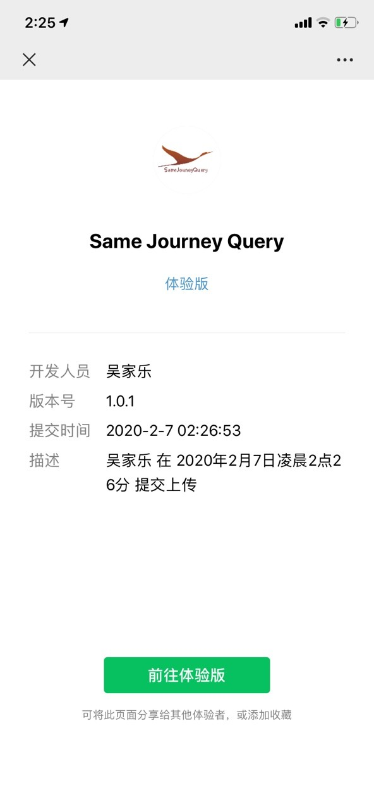
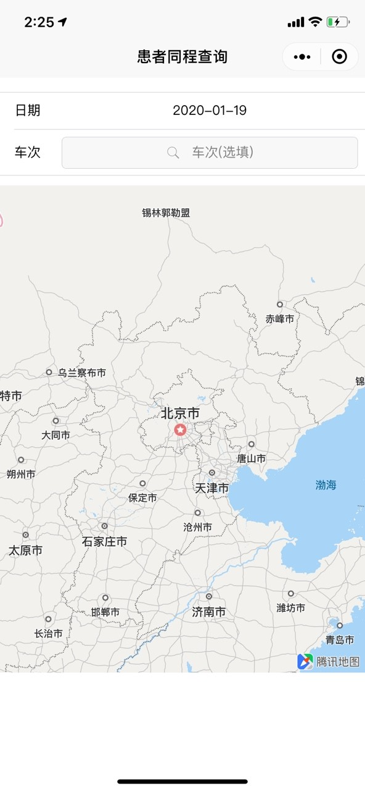
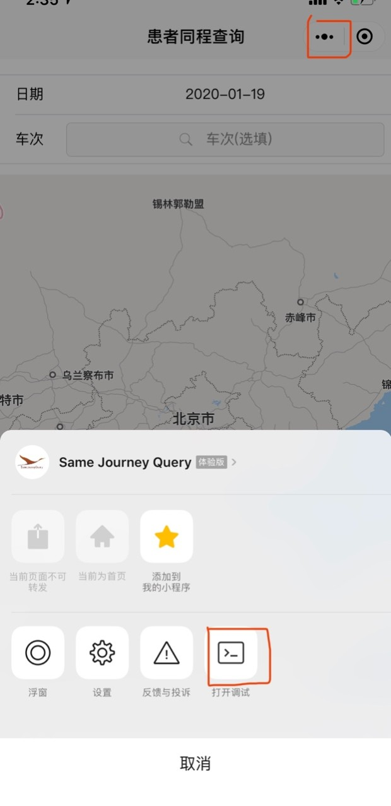
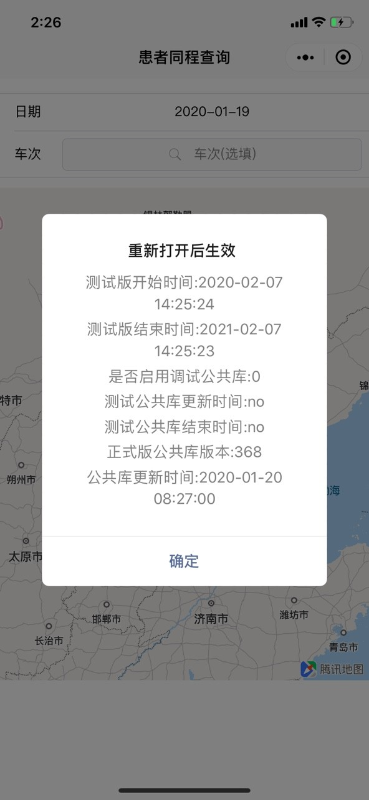
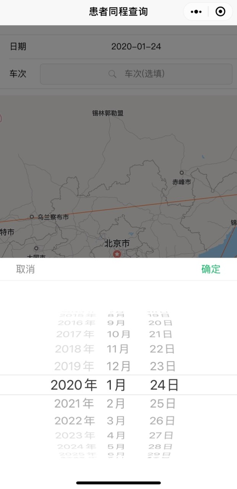

# project-x

## Backgroud

The epidemic 2019-nCov in Wuhan has affected the hearts of the whole wrold. At the peak of the Spring Festival Travle, people flowed and the country fell into a rapid circulation of viruses.

## Motivation

Help people find out if there is a virus carrier during the Spring Festival Journey.

## Development & Setup
```
npm install
```

### Compiles and hot-reloads for development
```
npm run dev:mp-weixin
```

### Compiles and minifies for production
```
npm run build:mp-weixin
```

## Usage

Scan QR-Code using Wechat.








### Customize configuration
See [Configuration Reference](https://cli.vuejs.org/config/).
